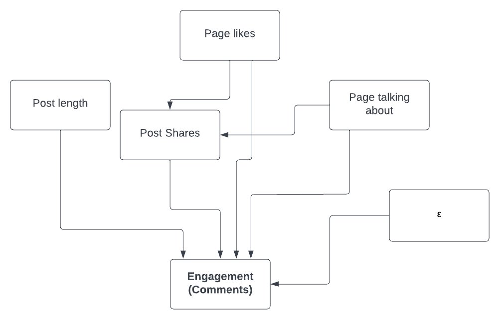

\newpage


```{r load_libraries, warning=FALSE, render=FALSE, echo=FALSE, error=FALSE, results='hide', message=FALSE}
# Required libraries 
library(tidyverse)
library(farff)
library(pdftools)
library(dplyr)
library(patchwork)
library(ggthemes)
library(ggpubr)
library(stargazer)
library(sandwich)
library(lmtest)
library(mctest)
library(knitr)
library(kableExtra)
```


# Introduction 
\setcounter{page}{1}
## Motivation 
<!-- Dataset with the most, or each in turn - can check for duplicates between all variants --> 
Professional sports teams often create Facebook pages as a way to build community, advertise, and keep their fans in the loop. Facebook is the largest social network in the world with an annual revenue of approximately $117 billion, with 97.5% generated from the advertisement sales\footnote{Meta's (formerly Facebook Inc.) annual revenue from 2009 to 2021: https://www.tinyurl.com/3sruyj2f}. Posts made by these organizations are the primary way of communicating to their audience. Our aim is to investigate how specific attributes of the post, Facebook page, and organization affect engagement on each post. The data set to be analyzed comes from UC Irvine’s Machine Learning Repository, and has scraped information from 2,770 pages, 57,000 posts, and 4,120,532 comments. 


## Research Question
For this project we’ll refer to **engagement** as the number of comments made on a post in the 24 hour period after it was published on Facebook. Our research question is as follows:

_how is user engagement on the Facebook platform affected by post length while controlling for other variables such as post date, post share counts, page category, and page popularity?_

The approach to operationlize this study is discussed in detail in the **Research Design** section of this report. Our results and processes are explained explicitly throughout our paper, and we provide a recommendation to changes to the Facebook platform that can lead to greater user engagement. Keeping in mind that user engagement is complex in nature in the world's largest social media platform, we also discuss the limitations of our approach and the steps we took to mitigate these effects.

# Data and Methodology 
## About the Data  

<!-- Description of raw data set -->
```{r import dataset, warning=FALSE, render=FALSE, echo=FALSE, error=FALSE, results='hide', message=FALSE}
# LOAD DATASET 
# List of names and descriptions
attr_table <- read.csv("../Attributes.csv")
# Load in feature variants from test set with names
Features_Variant_1 <- read.csv("../Dataset/Training/Features_Variant_1.csv", header = FALSE, col.names = attr_table$Name)
Features_Variant_2 <- read.csv("../Dataset/Training/Features_Variant_2.csv", header = FALSE, col.names = attr_table$Name)
Features_Variant_3 <- read.csv("../Dataset/Training/Features_Variant_3.csv", header = FALSE, col.names = attr_table$Name)
Features_Variant_4 <- read.csv("../Dataset/Training/Features_Variant_4.csv", header = FALSE, col.names = attr_table$Name)
Features_Variant_5 <- read.csv("../Dataset/Training/Features_Variant_5.csv", header = FALSE, col.names = attr_table$Name)

# For EDA purposes, merging all data sets and adding variable to indicate which variant the set came from 
Features_Variant_1 <- Features_Variant_1 %>% mutate(variant = 1)
Features_Variant_2 <- Features_Variant_2 %>% mutate(variant = 2)
Features_Variant_3 <- Features_Variant_3 %>% mutate(variant = 3)
Features_Variant_4 <- Features_Variant_4 %>% mutate(variant = 4)
Features_Variant_5 <- Features_Variant_5 %>% mutate(variant = 5)

# Merge all feature sets 
dataset <- bind_rows(
  Features_Variant_1, 
  Features_Variant_2,
  Features_Variant_3,
  Features_Variant_4,
  Features_Variant_5
)

# Variables for use in report 
initial_dataset_rows <- nrow(dataset)
initial_dataset_features <- dataset %>% colnames() %>% length()

# Select only required features 
dataset <- dataset %>% 
  # Drop un-required columns
  select(-c(5:29), -c(CC1:CC3), -PageCheckins, -CC5, -TargetVariable, -PostPromotionStatus) 

```

The data set to be analyzed is the [“Facebook Comment Volume Dataset Data Set”](https://archive.ics.uci.edu/ml/datasets/Facebook+Comment+Volume+Dataset\#). The initial data set includes `r initial_dataset_features` features and `r initial_dataset_rows` records. We narrow down the feature set to the following variables of interest\footnote{Full features list avaialable at https://archive.ics.uci.edu/ml/datasets/Facebook+Comment+Volume+Dataset\#}:

\begin{center}
$\textbf{Table 1. Data Description}$
\end{center}
|Feature                      |Description\footnote{Feature definitions taken from data source. Available at https://archive.ics.uci.edu/ml/datasets/Facebook+Comment+Volume+Dataset\#}|
|:------                      |:----------                                                            |
|CC4 (Outcome)                |Number of comments left on a post 24 hours after it has been published |
|Post Length (Intervention)   |Number of characters that a post has        |
|Post Share Count             |Number of times the post has been shared    |
|Page Likes                   |Number of likes on a post                   |
|Page Talking About           |Number of people who return to the page after liking (includes comments, likes, shares, etc. by visitors of the page) |
|Page Category                |Description of the page category |
|Base time                    |Value between 0 and 72 indicating the number of hours between a post being published, and the when the data was collected |
|Published Day                |Seven binary features indicating the day of the week the post was published |
|Base Day                     |Seven binary features indicating the day of the week the post data was scraped |


```{r Wrangle and filter sports teams, warning=FALSE, render=FALSE, echo=FALSE, error=FALSE, results='hide', message=FALSE}
# WRANGLE
# Get list of unique page category values in data set
# unique(dataset$PageCategory)

# Convert "Page Category" column to text (more descriptive for feature analysis) - Read all categories from category pdf
page_categories <- pdf_text("../Dataset/Catagory_File - Feature 4.pdf")
rows <- scan(textConnection(page_categories), what="character", sep = "\n")
# Create DF with category and index
page_categories_df <-  tibble(
  category = rows,
  code = seq(1, length(rows), by = 1)
)

# Add category (text) to main data set df
dataset <- left_join(x = dataset, y = page_categories_df, by = c("PageCategory" = "code"))

## Add columns for DayPublished, BaseDay, PublishedWeekend and BaseWeekend
# Pull weekdays into a single column - tidy data format + easier readability
dataset <- dataset %>% mutate(
  DayPublished = case_when(
    SundayPublished == 1 ~ "Sunday",
    MondayPublished == 1 ~ "Monday",
    TuesdayPublished == 1 ~ "Tuesday",
    WednesdayPublished == 1 ~ "Wednesday",
    ThursdayPublished == 1 ~ "Thursday",
    FridayPublished == 1 ~ "Friday",
    SaturdayPublished == 1 ~ "Saturday",
    TRUE ~ "other"
  )
) %>% mutate(
  BaseDay = case_when(
    SundayBaseTime == 1 ~ "Sunday",
    MondayBaseTime == 1 ~ "Monday",
    TuesdayBaseTime == 1 ~ "Tuesday",
    WednesdayBaseTime == 1 ~ "Wednesday",
    ThursdayBaseTime == 1 ~ "Thursday",
    FridayBaseTime == 1 ~ "Friday",
    SaturdayBaseTime == 1 ~ "Saturday",
    TRUE ~ "other"
  )
) %>% mutate(
  PublishedWeekend = ifelse(
    test = DayPublished == "Saturday" | DayPublished == "Sunday",
    yes = TRUE,
    no = FALSE
  )
) %>% mutate(
  BaseWeekend = ifelse(
    test = BaseDay == "Saturday" | BaseDay == "Sunday",
    yes = TRUE,
    no = FALSE
  )
)

# Drop non-required features
dataset <- dataset %>% select(-PageCategory, -c(SundayPublished:SaturdayBaseTime))

#FILTER
dataset_sports_teams <- dataset %>% filter(category == "Professional sports team") %>% filter(Basetime > 23)
dataset_sports_teams_rows <- nrow(dataset_sports_teams)

```

There are five variants of the data set, each scraped at a different time. For convenience in analysis and data exploration, we merge the five data sets and add a new variable to indicate the source variant for each record. We wrangle the data to reduce the 14 binary features indicate the days of the week the posts were published and scraped into two features, "Day Published" and "Base Day". We then created two binary features indicating where the new features were weekends (Saturday or Sunday) or not. The added variables include:

\begin{center}
$\textbf{Table 2. Additional Features}$
\end{center}

|Additional Features          |Description                                |
|:------                      |:----------                                |
|Day Published                |Day of the week the post was published     |
|Post Length (Intervention)   |Day of the week the post data was scraped  |
|Published Weekend            |Binary value indicating if post was published on the weekend   |
|Base Weekend                 |Binary value indicating if post data was scraped on a weekend  |

We are looking to create a model that explains levels of engagement 24 hours after a post is published. Therefore, we filter our dataset to remove all posts that are less than 24 hours old. Keeping records for posts published less than 24 before data was collected would skew the CC4 variable (number of comments in the last 24 hours since post was published), as we would be potentially comparing the number of comments for some posts that had 24 hours to accrue comments, with others that had only 2 for example. 

```{r Split EDA explore and test sets, warning=FALSE, render=FALSE, echo=FALSE, error=FALSE, results='hide', message=FALSE}
#Take a sample of the dataset_sports_teams for exploration
data_prop <- 0.3
set.seed(5)
dataset_eda <- slice_sample(dataset_sports_teams, prop = data_prop, replace = FALSE)
dataset_eda_rows <- dataset_eda %>% nrow()
```

We then subset our data to include only those where the category variable includes the term "Professional Sports Team". This reduces the total volume of our data set to `r dataset_sports_teams_rows` records. We further subset this, taking a `r data_prop * 100`% sub sample to perform our explanatory data analysis (EDA).

## Data exploration

We start our data exploration by looking at the distribution of our variables of interest as shown in Image 1.

\newpage
\begin{center}
$\textbf{Image 1. Histograms of Variables}$
\end{center}

```{r graph_function , include=FALSE,warning=FALSE, error=FALSE}

gghist <- function(df = NULL,           # Dataframe to be used
                   var = NULL,          # Variable to be plotted
                   binqty = NULL,       # Quantity of bins for the histogram
                   break_pnt = NULL,    # or specific breaks for X axis
                   graph_title = "",    # Title for the graph
                   graph_subtitle = "", # Subtitle for the graph
                   x_label = "",        # custom x axis label
                   y_label = "",        # custom x axis label
                   fill_color = "gray", # bar color
                   title_color = "black", #title colot
                   ggstat = "bin"       # stat transformation to use the data
                   ) {
  
  graph <- ggplot(df, var) +
    geom_histogram( stat = ggstat,
    breaks = break_pnt,
    bins = binqty, 
    fill = fill_color, 
    col = "white") +
    labs(
      title = graph_title,
      subtitle = graph_subtitle,
      x = x_label,
      y = y_label
    ) +
    theme_classic() +
    theme(
      plot.title = element_text(color = title_color,
                                size = 17,
                                face = "bold"),
      plot.subtitle = element_text(size = 13, face = "bold.italic", color = "#969696"),
      axis.title = element_text(color = "#969696",
                                size = 10,
                                face = "bold"),
      axis.text = element_text(color = "#969696", size = 10),
      axis.line = element_line(color = "#969696"),
      axis.ticks = element_line(color = "#969696"),
    ) 
  
  return (graph)
}

```

```{r EDA_Feature_distributions, warning=FALSE, render=FALSE, echo=FALSE, error=FALSE, out.width="33%", message=FALSE}
# EXPLORE FEATURE DISTRIBUTIONS

# # Glimpse at data set
# glimpse(dataset_eda)
# # Data summary
# summary(dataset_eda)


CC4_hist <-        gghist(df = dataset_eda,
                   var = aes(CC4),
                   graph_title = "CC4",
                   graph_subtitle = "Number of comments in last 24 hours.",
                   x_label = "CC4",
                   y_label = "Count",
                   fill_color = "light blue",
                   title_color = "#4472C4"
                   
)

PostLength_hist <- gghist(df = dataset_eda,
                   var = aes(Postlength),
                   graph_title = "Post Length",
                   x_label = "Post Length",
                   y_label = "Count",
                   fill_color = "#FF9999",
                   title_color = "#FF3B3B"
                   
)

PageLikes_hist <-  gghist(df = dataset_eda,
                   var = aes(PageLikes),
                   graph_title = "Page Likes",
                   x_label = "Page Likes",
                   y_label = "Count",
                   fill_color = "#C6E0B4",
                   title_color = "#73B149"
                   
)

PageTalk_hist <-   gghist(df = dataset_eda,
                   var = aes(PageTalkingAbout),
                   graph_title = "Page Talking About",
                   x_label = "Page Talking About",
                   y_label = "Count",
                   fill_color = "#FFE38B",
                   title_color = "#FFC000"
                   
)

PostShare_hist <-  gghist(df = dataset_eda,
                   var = aes(PostShareCount),
                   graph_title = "Post Share Count",
                   x_label = "Post Share Count",
                   y_label = "Count",
                   fill_color = "#B17ED8",
                   title_color = "#8037B7"
                   
)

BaseTime_hist <-  gghist(df = dataset_eda,
                   var = aes(Basetime),
                   graph_title = "Base Time",
                   x_label = "Base Time (Hours)",
                   y_label = "Count",
                   fill_color = "#00DBD6",
                   title_color = "#009999"
                   
)

DayPublish_hist <- gghist(df = dataset_eda,
                   var = aes(DayPublished),
                   graph_title = "Day Published",
                   x_label = "Day Published",
                   y_label = "Count",
                   fill_color = "#009999",
                   title_color = "#009999",
                   ggstat = "count"
                   
)

CC4_hist
PostLength_hist
PageLikes_hist
PageTalk_hist
PostShare_hist
BaseTime_hist
DayPublish_hist

```

We have two findings in our initial exploration:

### Skew of the data
We notice that the distributions are highly skewed to the left for Comments (CC4, our response variable), Post Length, Post Shares, Page likes, and Page talking about. This is especially the case for the Comments (CC4), Post Length, and Post Shares features where it appears that there is a large cluster around the 0 value. We count the number of zeros in our sub exploration data sample for each feature to confirm this.

```{r EDA_Count_0s_for_each_feature, warning=FALSE, render=FALSE, echo=FALSE, error=FALSE, results='hide', message=FALSE}
n_zero_CC4_dataset_eda <- dataset_eda %>% filter(CC4 == 0) %>% nrow()
n_zero_pagelikes_dataset_eda <- dataset_eda %>% filter(PageLikes == 0) %>% nrow()
n_zero_Pagetalkingabout_dataset_eda <- dataset_eda %>% filter(PageTalkingAbout == 0) %>% nrow()
n_zero_Postlength_dataset_eda <- dataset_eda %>% filter(Postlength == 0) %>% nrow()
n_zero_PostShareCount_dataset_eda <- dataset_eda %>% filter(PostShareCount == 0) %>% nrow()
```

\begin{center}
$\textbf{Table 3. Proportion of Zeroes}$
\end{center}
|Feature              |Proportion of zero values in sample |
|:------              |:----------:    |
|Comments (CC4)       |`r round(n_zero_CC4_dataset_eda/dataset_eda_rows, 2)*100`%                 |
|Post Length          |`r round(n_zero_Postlength_dataset_eda/dataset_eda_rows, 2)*100`%          |
|Page Likes           |`r round(n_zero_pagelikes_dataset_eda/dataset_eda_rows, 2)*100`%           |
|Page Talking About   |`r round(n_zero_Pagetalkingabout_dataset_eda/dataset_eda_rows, 2)*100`%    |
|Post Share Count     |`r round(n_zero_PostShareCount_dataset_eda/dataset_eda_rows, 2)*100`%      |

We find that `r round(n_zero_CC4_dataset_eda/dataset_eda_rows, 2)*100`% of the Facebook posts in our sample have no comments. The skew in our feature distributions suggests that variable transformations may be useful in modeling and interpretation of our data. A natural log transformation seems appropriate given the shape of our distributions. We choose to remove the zero values from our sample, as we would not be able to apply the same transformation to them.

```{r Remove zero values, warning=FALSE, render=FALSE, echo=FALSE, error=FALSE, results='hide', message=FALSE}
# Remove values from EDA dataset
dataset_eda <- dataset_eda %>% filter(!CC4 == 0) %>% filter(!Postlength == 0)

# Remove values from complete dataset
dataset_sports_teams <- dataset_sports_teams %>% filter(!CC4 == 0) %>% filter(!Postlength == 0)

# Count number of remaining rows in complete dataset
dataset_sports_teams_rows <- dataset_sports_teams %>% nrow()
```

This further reduces our sample size down to `r dataset_sports_teams_rows` comments.

We apply natural log transformations to our comments, page likes, page likes, page talking about, post length, and post shares features. The resulting distributions can be found below in Image 2.

\begin{center}
$\textbf{Image 2. Histograms of Transformed Variables}$
\end{center}

```{r EDA_Feature_Log_transformations, warning=FALSE, render=FALSE, echo=FALSE, error=FALSE, message=FALSE}
# FEATURE TRANSFORMATIONS

# Transform complete dataset
dataset_sports_teams <- dataset_sports_teams %>% mutate(
  log_CC4 = log(CC4),
  log_PostShareCount = log(PostShareCount),
  log_Postlength = log(Postlength),
  log_PageLikes = log(PageLikes),
  log_PageTalkingAbout = log(PageTalkingAbout)
  )

# Transform dataset used for EDA
dataset_eda <- dataset_eda %>% mutate(
  log_CC4 = log(CC4),
  log_PostShareCount = log(PostShareCount),
  log_Postlength = log(Postlength),
  log_PageLikes = log(PageLikes),
  log_PageTalkingAbout = log(PageTalkingAbout)
  )
```

```{r EDA_log_Feature_distributions, warning=FALSE, render=FALSE, echo=FALSE, error=FALSE, out.width="33%", message=FALSE}

# Plot Transformed distributions

log_CC4_hist <-        gghist(df = dataset_eda,
                       var = aes(log_CC4),
                       graph_title = "CC4",
                       graph_subtitle = "Log Transformation",
                       x_label = "ln(CC4)",
                       y_label = "Count",
                       fill_color = "#4472C4",
                       title_color = "#4472C4"
                       
)

log_PostLength_hist <- gghist(df = dataset_eda,
                       var = aes(log_Postlength),
                       graph_title = "Post Length",
                       graph_subtitle = "Log Transformation",
                       x_label = "ln(Post Length)",
                       y_label = "Count",
                       fill_color = "#FF3B3B",
                       title_color = "#FF3B3B"
                       
)

log_PageLikes_hist <-  gghist(df = dataset_eda,
                       var = aes(log_PageLikes),
                       graph_title = "Page Likes",
                       graph_subtitle = "Log Transformation",
                       x_label = "ln(Page Likes)",
                       y_label = "Count",
                       fill_color = "#73B149",
                       title_color = "#73B149"
                       
)

log_PageTalk_hist <-   gghist(df = dataset_eda,
                       var = aes(log_PageTalkingAbout),
                       graph_title = "Page Talking About",
                       graph_subtitle = "Log Transformation",
                       x_label = "ln(Page Talking About)",
                       y_label = "Count",
                       fill_color = "#FFC000",
                       title_color = "#FFC000"
                       
)

log_PostShare_hist <-  gghist(df = dataset_eda,
                       var = aes(log_PostShareCount),
                       graph_title = "Post Share Count",
                       graph_subtitle = "Log Transformation",
                       x_label = "ln(Post Share Count)",
                       y_label = "Count",
                       fill_color = "#8037B7",
                       title_color = "#8037B7"
                       
)

log_CC4_hist
log_PostLength_hist
log_PageLikes_hist
log_PageTalk_hist
log_PostShare_hist

```


### Outliers in the Data

The histograms above for the untransformed variables confirms that our data set contains several outliers that heavily skew our data. The features with outliers include CC4, Page Likes, Page Talking About, Post Length, and Post Shares which can make interpreting the coefficient of the variables more difficult once we have the results from the linear regressions. The boxplots below provide a representation on the quantile distributions of these outliers.

\newpage
\begin{center}
$\textbf{Image 3. Boxplots of Variables}$
\end{center}
```{r EDA_Outlier Analysis, echo=FALSE, error=FALSE, fig.height=4, fig.width=20, message=FALSE, warning=FALSE, render=FALSE}

# CC4 
boxplot_CC4 <- ggplot(dataset_sports_teams) +
  aes(y = log_CC4) +
  geom_boxplot(fill = "#0c4c8a") + 
  coord_flip() +
  theme_minimal() +
  labs(title = "Number of Comments",
       x = "ln(CC4)", 
       y = "Values") +
  theme(
    plot.title = element_text(color = "#4472C4",
                              size = 17,
                              face = "bold"),
    axis.title = element_text(color = "#969696",
                              size = 15,
                              face = "bold"),
    axis.text = element_text(color = "#969696", size = 10),
  )

# Post Length
boxplot_postlength <- ggplot(dataset_sports_teams) +
  aes(x = "", y = log_Postlength) +
  geom_boxplot(fill = "#A20000") +
  coord_flip() +
  theme_minimal() +
  labs(title = "Post Length",
       x = "ln(Postlength)", 
       y = "Values") +
  theme(
    plot.title = element_text(color = "#FF3B3B",
                              size = 17,
                              face = "bold"),
    axis.title = element_text(color = "#969696",
                              size = 15,
                              face = "bold"),
    axis.text = element_text(color = "#969696", size = 10),
  )

# Page Likes
boxplot_pagelikes <- ggplot(dataset_sports_teams) +
  aes(x = "", y = log_PageLikes) +
  geom_boxplot(fill = "#4C7430") +
  coord_flip() +
  theme_minimal() +
  labs(title = "Page Likes",
       x = "ln(PageLikes)", 
       y = "Values") +
  theme(
    plot.title = element_text(color = "#73B149",
                              size = 17,
                              face = "bold"),
    axis.title = element_text(color = "#969696",
                              size = 15,
                              face = "bold"),
    axis.text = element_text(color = "#969696", size = 10),
  )

# Page Talking About
boxplot_pagetalkingabout <- ggplot(dataset_sports_teams) +
  aes(x = "", y = log_PageTalkingAbout) +
  geom_boxplot(fill = "#BC8F00") +
  coord_flip() +
  theme_minimal() +
  labs(title = "Page Talking About", 
       x = "ln(PageTalkingAbout)", 
       y = "Values") +
  theme(
    plot.title = element_text(color = "#FFC000",
                              size = 17,
                              face = "bold"),
    axis.title = element_text(color = "#969696",
                              size = 15,
                              face = "bold"),
    axis.text = element_text(color = "#969696", size = 10),
  )

# Post Shares
boxplot_postshares <- ggplot(dataset_sports_teams) +
  aes(x = "", y = log_PostShareCount) +
  geom_boxplot(fill = "#3C1A56") +
  coord_flip() +
  theme_minimal() +
  labs(title = "Post Shares",
       x = "ln(PostShares)", 
       y = "Values") +
  theme(
    plot.title = element_text(color = "#8037B7",
                              size = 17,
                              face = "bold"),
    axis.title = element_text(color = "#969696",
                              size = 15,
                              face = "bold"),
    axis.text = element_text(color = "#969696", size = 10),
  )

boxplot_CC4
boxplot_postlength
boxplot_pagelikes
boxplot_pagetalkingabout
boxplot_postshares
```

The presence of these outliers in our outcome and explanatory variables suggests that we will perform additional statistical procedures such as Cook's Distance and Statistical Leverage during the modeling phase in order to take into account for the effect of outliers in our data. Performing these tests will also allow us to troubleshoot some of the potential issues that we will face in estimating the results from the Variance-Covariance matrix between the explanatory variables in each model in this study.


## Checking our intuitions
Ahead of preparing our model, we have some assumptions regarding the relationships between our features and our outcome variable (post engagement, as measured by number of comments). Namely, we assume page likes, page talking about, and post shares to be positively correlated with the engagement. Here, we produce joint distribution plots between our outcome variable, and features of interest in Image 4. 

\begin{center}
$\textbf{Image 4. Joint Distributions of Variables}$
\end{center}
```{r EDA_Joint_Distributions, warning=FALSE, render=FALSE, echo=FALSE, error=FALSE, out.width="50%", message=FALSE}
# EXPLORE JOINT DISTRIBUTIONS WITH TARGET VAR
# Scatter plots

Postlength_CC4_distr <- dataset_eda %>%
  ggplot(aes(x = log_Postlength, y = log_CC4)) +
  geom_point(alpha = 0.2, color = "#FF9999") +
  geom_smooth(method = "lm", se=FALSE, col='blue', linetype='dashed') +
  theme_minimal() +
  labs(title = "Post Length",
       x = "ln(Post Length)", 
       y = "ln(CC4)") +
  theme(
    plot.title = element_text(color = "#FF3B3B",
                              size = 17,
                              face = "bold"),
    axis.title = element_text(color = "#969696",
                              size = 10,
                              face = "bold"),
    axis.text = element_text(color = "#969696", size = 10),
  )

PageLikes_CC4_distr<- dataset_eda %>%
  ggplot(aes(x = log_PageLikes, y = log_CC4)) +
  geom_point(alpha = 0.2, color = "#C6E0B4") +
  geom_smooth(method = "lm", se=FALSE, col='blue', linetype='dashed') +
  theme_minimal() +
  labs(title = "Page Likes",
       x = "ln(Page Likes)", 
       y = "ln(CC4)") +
  theme(
    plot.title = element_text(color = "#73B149",
                              size = 17,
                              face = "bold"),
    axis.title = element_text(color = "#969696",
                              size = 10,
                              face = "bold"),
    axis.text = element_text(color = "#969696", size = 10),
  )

PageTalkingAbout_CC4_distr <- dataset_eda %>%
  ggplot(aes(x = log_PageTalkingAbout, y = log_CC4)) +
  geom_point(alpha = 0.2, color = "#FFE38B") +
  geom_smooth(method = "lm", se=FALSE, col='blue', linetype='dashed') +
  theme_minimal() +
  labs(title = "Page Talking About",
       x = "ln(Page Talking About)", 
       y = "ln(CC4)") +
  theme(
    plot.title = element_text(color = "#FFC000",
                              size = 17,
                              face = "bold"),
    axis.title = element_text(color = "#969696",
                              size = 10,
                              face = "bold"),
    axis.text = element_text(color = "#969696", size = 10),
  )

PostShareCount_CC4_distr <- dataset_eda %>%
  ggplot(aes(x = log_PostShareCount, y = log_CC4)) +
  geom_point(alpha = 0.2, color = "#B17ED8") +
  geom_smooth(method = "lm", se=FALSE, col='blue', linetype='dashed') +
  theme_minimal() +
  labs(title = "Post Shares",
       x = "ln(PostShares)", 
       y = "ln(CC4)") +
  theme(
    plot.title = element_text(color = "#8037B7",
                              size = 17,
                              face = "bold"),
    axis.title = element_text(color = "#969696",
                              size = 10,
                              face = "bold"),
    axis.text = element_text(color = "#969696", size = 10),
  )

Postlength_CC4_distr
PageLikes_CC4_distr
PageTalkingAbout_CC4_distr
PostShareCount_CC4_distr

```
  
Adding a regression line through our joint distributions provides some support for our intuitions. We see a positive gradient for page likes, page talking about, and post shares feature. 


# Research Design
This will be a quantitative, retrospective analysis of engagement of Facebook posts. _We operationalize the concept of engagement as the number of comments contributed to a Facebook post. The aim of our design will be to produce an explanatory model for engagement_. Our target will be to produce a result that can be shared with the product team at Facebook in order to make an update to, or around the functionality of the posts feature that will enhance engagement levels on the platform. For example, the finding that shorter posts drive more engagement may provide the rational for introducing character restrictions. Alternatively, different recommendations may be pushed to owners of different page categories nudging them on the direction of a more optimal post length. In our case, we focus on posts published on professional sports team pages.  

We first conceptualize a causal theory for the engagement level of a post during the last 24 hours relative to when the post was initially published. We consider the number of comments that a post receives as our metric for product success. Our causal theory states that the length of a Facebook post affects the number of comments within the next 24 hours while controlling for other variables such as post share count, page popularity and the base time at which the post was published relative to when the data was collected. Considering the variables that we believe to impact engagement as represented by the number of comments that a post receives, we form the following structural model:



To evaluate our hypothesis we established the following regression model:

$$
\begin{aligned}
    \text{Comments} = \beta_0 &+ \beta_1 \text{PostLength} + \beta_2 \text{PostShares} + \beta_3 \text{PostPopularity} + \beta_4 \text{PageTalkingAbout} \\
    &+ \beta_5 \text{DayPublished} + \beta_6 \text{PostAge} + \varepsilon \\
\end{aligned}
$$
 
We start with an exploration of the data, checking the joint distributions of each causal variable with our outcome variable. Following an initial assessment to validate our assumptions, we  perform transformations for our variables that may better model the impact on engagement. The source of the data set stems from a program written in Java and Facebook Query Language to scrape the pages, posts, and comments\footnote{Singh, Kamaljot. “Comment Volume Prediction using Neural Networks and Decision Trees.” International Conference on Modelling and Simulation, 2015, https://ijssst.info/Vol-16/No-5/paper16.pdf}. We use the Ordinary Least Squares Regression to produce our model of the data, and validate the assumptions required. We plan to include in our model a number of control features, which we do not believe to have a direct causal effect on our outcome variable, but may be associated with levels of engagement. During the modeling stage of the project, ANOVA F-Tests will be conducted to assess the efficacy of adding additional variables to the model to determine how successful the Facebook platform is in terms of number of comments which is the engagement metric we wish to analyze. We will do this process to develop at least three models:  

1. The base model where we regress the number of comments on the post length alone.
2. A model where we regress the number of comments on all of the desired covariates (control as well as causal variables).
3. A third model where we add interaction terms for our covariates.

\newpage
# Modeling

```{r Get Dataset for modeling, warning=FALSE, render=FALSE, echo=FALSE, error=FALSE, fig.width = 20, fig.height=20, message=FALSE}
dataset_model <- setdiff(dataset_sports_teams, dataset_eda)
```


## Base Model
Our first model will regress our outcome variable on our treatment variable alone.  

$$
\text{Model 1}: ln(\text{Comments}) = \beta_0 + \beta_1 ln(\text{PostLength}) + \varepsilon
$$ 
\begin{center}
$\textbf{Image 5. Joint Distributions of Variables}$
\end{center}
```{r Base Model, warning=FALSE, render=FALSE, echo=FALSE, error=FALSE, message=FALSE, results=FALSE, out.width="80%", fig.align='center'}
# Base model - post length as treatment 
base_model = lm(log_CC4 ~ log_Postlength , data=dataset_model)
base_model$coefficients

Postlength_CC4_base_model <- dataset_model %>%
  ggplot(aes(x = log_Postlength, y = log_CC4)) +
  geom_point(alpha = 0.2, color = "#4472C4") +
  geom_smooth(method = "lm", se=FALSE, col='blue', linetype='dashed') +
  theme_minimal() +
  labs(x = "ln(Post Length)", 
       y = "ln(CC4)") +
  theme(
    plot.title = element_text(color = "#FF3B3B",
                              size = 17,
                              face = "bold"),
    axis.title = element_text(color = "#969696",
                              size = 10,
                              face = "bold"),
    axis.text = element_text(color = "#969696", size = 10),
  )

Postlength_CC4_base_model

```


The resulting plots below show the results with Cook's distance to remove the outliers on the base model. In the plot shown below, the results from the Cook's distance plot indicate the values above a Cook's Distance of 0.00050 are highly influential outliers. Using these influential values, we will remove the outliers from the data set.
```{r Cooks Distance 1, warning=FALSE, render=FALSE, echo=FALSE, error=FALSE, message=FALSE, out.width= "80%", fig.align='center'}

# Cook's Distance calculation
cooksD_model1 <- cooks.distance(base_model)
influential <- cooksD_model1[(cooksD_model1 > (3*mean(cooksD_model1, na.rm=TRUE)))]

# Display the influential values
# influential

# Cook's Distance plot
ggplot(base_model, aes(seq_along(.cooksd), .cooksd)) +
  geom_col() +
  geom_point(color="#009999", size=2) +
  labs(title = "Image 6: Cook's Distance for Base Model",
       x = "Observation Number", 
       y = "Cook's Distance") +
  theme(plot.title = element_text(hjust = 0.5)) +
  theme(
    axis.title = element_text(color = "#969696",
                              size = 10,
                              face = "bold"),
    axis.text = element_text(color = "#969696", size = 10),
    axis.line = element_line(color = "#969696"),
    axis.ticks = element_line(color = "#969696")
  ) 

```


The plots for the Statistical Leverage on the base model indicate that none of the values are greater than 2. Since the threshold for Statistical Leverage has been set at 2, and none of the observations are greater than 2, then none of the observations will be removed using the Statistical Leverage approach.

```{r Statistical Leverage on Base Model, warning=FALSE, render=FALSE, echo=FALSE, error=FALSE, message=FALSE, out.width= "80%", fig.align='center'}
# Calculate leverage for each observation in the model
hats <- as.data.frame(hatvalues(base_model))

# Display leverage stats for each observation
# hats

# Sort observations by leverage, descending
hats_sorted <- hats[order(-hats['hatvalues(base_model)']), ]

# Plot Statistical Leverage
#plot leverage values for each observation
plot(hatvalues(base_model),
     main = "Image 7: Statistical Leverage for Base Model",
     cex.main = 0.8,
     ylab="Leverage Score",
     type = 'h',
     col = "#009999",
     col.axis = "#969696",  
     fg = "#969696",
     col.lab = "#969696",
     cex.axis = 0.5,
     cex.lab = 0.7)

# Since none of the values are greater than 2, then none of the observations in the data set have high leverage.
```


```{r Removing Outliers 1, warning=FALSE, render=FALSE, echo=FALSE, error=FALSE, message=FALSE}
# Save the sample size of the current data_set
sample_size <- nrow(dataset_model)

# Removing Outliers
# influential row numbers
influential <- as.numeric(names(cooksD_model1)[(cooksD_model1 > (4/sample_size))])

dataset_model1_no_outliers <- dataset_model[-influential, ]

```


## Second Model
In the second model, we include a number of control variables that we believe to have a causal link with the number of comments generated (our response): 
1. Page Likes: We expect that the more likes a page has, the more comments posts on that page will receive 
2. Page Talking About: We expect a positive relationship between the number of users that interact with a page, and the engagement on the posts on that page 
3. Post Shares: We expect that the more times a post has been shared, the more comments it will receive 

The second model is evaluated as follows:  

$$
\begin{aligned}
    \text{Model 2}: ln(\text{Comments}) = \beta_0 &+ \beta_1 ln(\text{PostLength}) + \beta_2 ln(\text{PageTalkingAbout}) + \beta_3 ln(\text{PageLikes})\\
    & + \beta_4 ln(\text{PostShares}) + \varepsilon\\
\end{aligned}
$$

```{r Model 2, warning=FALSE, render=FALSE, echo=FALSE, error=FALSE, message=FALSE, results="asis"}
# Base model - post length as treatment 
model_2 = lm(log_CC4 ~ log_Postlength + log_PageTalkingAbout + log_PageLikes + log_PostShareCount, data=dataset_model)
# model_2$coefficients
```

For Model 2, the resulting plots below show the results with Cook's distance to remove the outliers. The results from the Cook's distance plot indicate that values above a Cook's Distance of 0.0020 are highly influential outliers. Using these influential values, we will remove the outliers from the data set based on the results from the second model.

```{r Cooks Distance 2, warning=FALSE, render=FALSE, echo=FALSE, error=FALSE, message=FALSE, out.width= "80%", fig.align='center'}

# Cook's Distance calculation
cooksD_model2 <- cooks.distance(model_2)
influential <- cooksD_model2[(cooksD_model2 > (3*mean(cooksD_model2, na.rm=TRUE)))]

# Display the influential values
# influential

# Cook's Distance plot
#plot(model_2, which=4)
ggplot(model_2, aes(seq_along(.cooksd), .cooksd)) +
  geom_col() +
  geom_point(color="#009999", size=2) +
  labs(title = "Image 8: Cook's Distance for Model 2",
       x = "Observation Number", 
       y = "Cook's Distance") +
  theme(plot.title = element_text(hjust = 0.5)) +
  theme(
    axis.title = element_text(color = "#969696",
                              size = 10,
                              face = "bold"),
    axis.text = element_text(color = "#969696", size = 10),
    axis.line = element_line(color = "#969696"),
    axis.ticks = element_line(color = "#969696")
  ) 

```

The plots for the Statistical Leverage on Model 2 indicate that none of the values are greater than 2. Since the threshold for Statistical Leverage has been set at 2, and none of the observations are greater than 2, then none of the observations will be removed using the Statistical Leverage approach.

```{r Statistical Leverage on Model 2, warning=FALSE, render=FALSE, echo=FALSE, error=FALSE, message=FALSE, out.width= "80%", fig.align='center'}
# Calculate leverage for each observation in the model
hats <- as.data.frame(hatvalues(model_2))

# Display leverage stats for each observation
# hats

# Sort observations by leverage, descending
hats_sorted <- hats[order(-hats['hatvalues(model_2)']), ]

# Plot Statistical Leverage
#plot leverage values for each observation
plot(hatvalues(model_2),
     main = "Image 9: Statistical Leverage for Model 2",
     cex.main = 0.8,
     ylab="Leverage Score",
     type = 'h',
     col = "#009999",
     col.axis = "#969696",  
     fg = "#969696",
     col.lab = "#969696",
     cex.axis = 0.5,
     cex.lab = 0.7)

# Since none of the values are greater than 2, then none of the observations in the data set have high leverage.
```


```{r Removing Outliers 2, warning=FALSE, render=FALSE, echo=FALSE, error=FALSE, message=FALSE}
# Save the sample size of the current data_set
sample_size <- nrow(dataset_model)

# Removing Outliers
# influential row numbers
influential <- as.numeric(names(cooksD_model2)[(cooksD_model2 > (4/sample_size))])

dataset_model2_no_outliers <- dataset_model[-influential, ]

```


## Third Model
For our third model, we include an additional variables of when the post was published. We do not draw a direct causal link between the day a post was published, but expect that engagement levels on Facebook may vary by day of the week. The additional variables are: 
1. Post Age (Basetime): We expect the age of a post to impact the number of comments it generates 
2. Weekend: Whether the post was published on a weekend or not  


Our third model is evaluated as follows:
$$
\begin{aligned}
    \text{Model 3}: ln(\text{Comments}) = \beta_0 &+ \beta_1 ln(\text{PostLength}) + \beta_2 ln(\text{PageTalkingAbout}) + \beta_3 ln(\text{PageLikes})\\
    & + \beta_4 ln(\text{PostShares}) + \beta_5 \text{Weekend} + \beta_6 \text{PostAge} + \varepsilon\\
\end{aligned}
$$

```{r Model 3, warning=FALSE, render=FALSE, echo=FALSE, error=FALSE, message=FALSE, results="asis"}
# Base model - post length as treatment 
model_3 = lm(log_CC4 ~ log_Postlength + log_PageTalkingAbout + log_PageLikes + log_PostShareCount + PublishedWeekend + Basetime, data=dataset_model)
# model_3$coefficients
```


For Model 3, the plots below show the results with Cook's distance to remove the outliers. The results from this Cook's distance plot indicate that values above a Cook's Distance of 0.00025 are highly influential outliers. Using these influential values, we will remove the outliers from the data set based on the results from the third model.

```{r Cooks Distance 3, warning=FALSE, render=FALSE, echo=FALSE, error=FALSE, message=FALSE, out.width= "80%", fig.align='center'}

# Cook's Distance calculation
cooksD_model3 <- cooks.distance(model_3)
influential <- cooksD_model3[(cooksD_model3 > (3*mean(cooksD_model3, na.rm=TRUE)))]

# Display the influential values
# influential

# Cook's Distance plot
# plot(model_3, which=4)
ggplot(model_3, aes(seq_along(.cooksd), .cooksd)) +
  geom_col() +
  geom_point(color="#009999", size=2) +
  labs(title = "Image 10: Cook's Distance for Model 3",
       x = "Observation Number", 
       y = "Cook's Distance") +
  theme(plot.title = element_text(hjust = 0.5)) +
  theme(
    axis.title = element_text(color = "#969696",
                              size = 10,
                              face = "bold"),
    axis.text = element_text(color = "#969696", size = 10),
    axis.line = element_line(color = "#969696"),
    axis.ticks = element_line(color = "#969696")
  ) 
```


The plots for the Statistical Leverage on Model 3 indicate that none of the values are greater than 2. Since the threshold for Statistical Leverage has been set at 2, and none of the observations are greater than 2, then none of the observations will be removed using the Statistical Leverage approach.

```{r Statistical Leverage on Model 3, warning=FALSE, render=FALSE, echo=FALSE, error=FALSE, message=FALSE, out.width= "80%", fig.align='center'}
# Calculate leverage for each observation in the model
hats <- as.data.frame(hatvalues(model_3))

# Display leverage stats for each observation
# hats

# Sort observations by leverage, descending
hats_sorted <- hats[order(-hats['hatvalues(model_3)']), ]

# Plot Statistical Leverage
#plot leverage values for each observation
plot(hatvalues(model_3),
     main = "Image 11: Statistical Leverage for Model 3",
     cex.main = 0.8,
     ylab="Leverage Score",
     type = 'h',
     col = "#009999",
     col.axis = "#969696",  
     fg = "#969696",
     col.lab = "#969696",
     cex.axis = 0.5,
     cex.lab = 0.7)

# Since none of the values are greater than 2, then none of the observations in the data set have high leverage.
```


```{r Removing Outliers 3, warning=FALSE, render=FALSE, echo=FALSE, error=FALSE, message=FALSE}
# Save the sample size of the current data_set
sample_size <- nrow(dataset_model)

# Removing Outliers
# influential row numbers
influential <- as.numeric(names(cooksD_model3)[(cooksD_model3 > (4/sample_size))])

dataset_model3_no_outliers <- dataset_model[-influential, ]

```

## Fourth model
Our final model includes interaction terms for features that we believe to be related. We include interaction terms for:

1. Post share count and the post age (Basetime variable): We expect that the duration of a post's presence on a page will impact the number of comments it generates. 
2. We expect that there is some interaction between the number of likes a page has (a proxy for page popularity) and the number of people that interact with that page (page talking about). It would be reasonable to assume that the more popular a page is, the more frequently it is visited. 
3. Post length and Weekend, as we may assume that posting behavior varies on the weekend as compared with weekdays. 

So our fourth and final model is:
$$
\begin{aligned}
    \text{Model 4}: ln(\text{Comments}) = \beta_0 &+ \beta_1 ln(\text{PostLength}) + \beta_2 ln(\text{PageTalkingAbout}) + \beta_3 ln(\text{PageLikes})\\
    & + \beta_4 ln(\text{PostShares}) + \beta_5 \text{Weekend} + \beta_6 \text{PostAge} \\
    & + \beta_7 ln(\text{PostLength}) * \text{Weekend} + \beta_8 ln(\text{PageTalkingAbout}) * \text{PageLikes} \\
    & + \beta_9 ln(\text{PostShares}) * \text{PostAge} + \varepsilon\\
\end{aligned}
$$

```{r Model 4, warning=FALSE, render=FALSE, echo=FALSE, error=FALSE, message=FALSE}
# Base model - post length as treatment 
model_4 = lm(log_CC4 ~ log_Postlength + log_PageTalkingAbout + log_PageLikes + log_PostShareCount + PublishedWeekend + (log_Postlength*PublishedWeekend) + (log_PageLikes*log_PageTalkingAbout) + (log_PostShareCount*Basetime), data=dataset_model)
# model_4$coefficients
```


Lastly, the plot below show the results with Cook's distance to remove the outliers based on the regression of model 4. The results from the Cook's distance plot indicate the values above a Cook's Distance of 0.0015 are highly influential outliers. Using these influential values, we will remove the outliers from the data set based on the results from the fourth model.

```{r Cooks Distance 4, warning=FALSE, render=FALSE, echo=FALSE, error=FALSE, message=FALSE, out.width= "80%", fig.align='center'}

# Cook's Distance calculation
cooksD_model4 <- cooks.distance(model_4)
influential <- cooksD_model4[(cooksD_model4 > (3*mean(cooksD_model4, na.rm=TRUE)))]

# Display the influential values
# influential

# Cook's Distance plot
#plot(model_4, which=4)
ggplot(model_2, aes(seq_along(.cooksd), .cooksd)) +
  geom_col() +
  geom_point(color="#009999", size=2) +
  labs(title = "Image 12: Cook's Distance for Model 4",
       x = "Observation Number", 
       y = "Cook's Distance") +
  theme(plot.title = element_text(hjust = 0.5)) +
  theme(
    axis.title = element_text(color = "#969696",
                              size = 10,
                              face = "bold"),
    axis.text = element_text(color = "#969696", size = 10),
    axis.line = element_line(color = "#969696"),
    axis.ticks = element_line(color = "#969696")
  ) 
```

The plots for the Statistical Leverage on Model 4 indicate that none of the values are greater than 2. Since the threshold for Statistical Leverage has been set at 2, and none of the observations are greater than 2, then none of the observations will be removed using the Statistical Leverage approach.

```{r Statistical Leverage on Model 4, warning=FALSE, render=FALSE, echo=FALSE, error=FALSE, message=FALSE, out.width= "80%", fig.align='center'}
# Calculate leverage for each observation in the model
hats <- as.data.frame(hatvalues(model_4))

# Display leverage stats for each observation
# hats

# Sort observations by leverage, descending
hats_sorted <- hats[order(-hats['hatvalues(model_4)']), ]

# Plot Statistical Leverage
#plot leverage values for each observation
plot(hatvalues(model_4),
     main = "Image 13: Statistical Leverage for Model 4",
     cex.main = 0.8,
     ylab="Leverage Score",
     type = 'h',
     col = "#009999",
     col.axis = "#969696",  
     fg = "#969696",
     col.lab = "#969696",
     cex.axis = 0.5,
     cex.lab = 0.7)

# Since none of the values are greater than 2, then none of the observations in the data set have high leverage.
```


```{r Removing Outliers 4, warning=FALSE, render=FALSE, echo=FALSE, error=FALSE, message=FALSE}
# Save the sample size of the current data_set
sample_size <- nrow(dataset_model)

# Removing Outliers
# influential row numbers
influential <- as.numeric(names(cooksD_model4)[(cooksD_model4 > (4/sample_size))])

dataset_model4_no_outliers <- dataset_model[-influential, ]

```


Taking the variance covariance matrix of our final model in Table 4, we note that the variance of the coefficients is close zero (also see standard errors in results section). This makes us skeptical of the results of the model. We experiment with a smaller sample size to check the effects of sample size on the variances, however we find similar results even when reducing the sample size to 30% of the total. We also attempt to remove zero values and outliers from our models, but the results in the variances remain near zero. We note that this result requires further investigation.  

```{r Coef Variance, warning=FALSE, render=FALSE, echo=FALSE, error=FALSE, message=FALSE, out.width= "80%", results="asis"}
#vcovHC(model_4) %>% round(digits = 3)

model_4_names <- c("(Intercept)","ln(Post Length)", "ln(Page Talking About)", "ln(Page Likes)", "ln(Post Share Count)", "Weekend", "Post Age (hours)",  "Post Length * Weekend", "Page Talking about * Page Likes", "Post Age * ln(Post Share Count)")

vcov_mat <- vcov(model_4)

colnames(vcov_mat) <- model_4_names
rownames(vcov_mat) <- model_4_names

vcov_mat %>%
  round(digits = 3) %>%
  kable(format = "latex", booktabs = T, caption = "Variance-Covariance Matrix for Model 4") %>%
  kable_styling(latex_options = c("striped", "scale_down"), font_size = 7, full_width = FALSE) %>%
  column_spec(1, color = "#0099F8", bold = T) %>% 
  row_spec(0, bold = T, color = "white", background = "#0099F8",extra_latex_after = "\\arrayrulecolor{white}") %>%
  sub("\\\\toprule", "", .)
```


# Results
The results of our models can be found in Table 5 on the next page of this report.  


```{r Models results, warning=FALSE, render=FALSE, echo=FALSE, error=FALSE, message=FALSE, results='asis'}
stargazer(
 base_model,
 model_2, 
 model_3, 
 model_4, 
 title="Regression Results",
 font.size = "small",
 header=FALSE,
 align=TRUE,
 type = 'latex',
 no.space=TRUE,
 column.sep.width = "-10pt",
 float.env = "sidewaystable",
 dep.var.labels = "Comments Count (log\\_CC4)",
 order="Constant",
 covariate.labels = c("(Intercept)","ln(Post Length)", "ln(Page Talking About)", "ln(Page Likes)", "ln(Post Share Count)", "Weekend", "Post Age (hours)",  "Interaction: Post Length | Weekend", "Interaction: Page Talking about | Page Likes", "Interaction: Post Age | ln(Post Share Count)")
 )
```

The base model confirms a positive relationship between the length of a post and the number of comments received 24 hours after a post was published. Holding everything else constant, this model states that a 1% increase in the post length leads to an average increase of 0.027% in the number of comments. The $R^2$ is quite low at 0.0002 suggesting that 0.0002 percent of the variation in the number of commnets is attributed to the single explanatory variable. Although the explanatory is statistically significant, this model alone does not produce practically significant results due to the low fit of the model and the omitted variable bias.

Next, we add three control variables as explained in section 4.2 of the report and we see improvements to our results. The addition of these three explanatory variables reflects user behavior deemed necessary to assess user engagement. This is reflected with an $R^2$ of 0.538 and statistically significant explanatory varibles. Model 2 infers that, while holding everything else constant, a 1% increase in the post length leads to an average increase of 0.029% in the number of comments. Interestingly, there is a negative coefficient on the number of likes which intuitively does not make sense as one would expect that higher likes on Facebook posts would lead to higher comments. For this model, the results may not be practically significant due to the contradictory results reported on the coefficient for the number of likes. When performing the ANOVA F-Test between the base model and model 2, we obtain the results below. Given that the p-value is below 0.05, we reject the null hypothesis that there is no difference between both models and we choose model 2 over the base model.

```{r ANOVA F-Test for Base Model and Model 2, echo=TRUE}
anova(model_2, base_model, test = 'F')
```

In model three, we control for the weekend and age of the post. As expected, the model presents a positive relationship between the Weekend control binary variable and the number of comments. If the post was published on a weekend, this would lead to an increase of 7.6% in the number of comments while holding everything else constant. This is intuitive as one would expect that people on the weekends would have more time to comment on a Facebook post as opposed to a weekday when they may have other obligations such as school or work.  The covariates in model 3 are statistically significant, and we find the results could be practically significant for Facebook on Facebook. This company should incentivize individuals to create posts on weekends to increase user engagement. Additionally, the $R^2$ marginally increased to 0.539 and the explanatory variable of interest, ln(Post Length), remains with a positive coefficient. However, the negative coefficient of the Page Likes remains which remains counterintuitive. The results for the ANOVA F-Test between model 2 and model 3 are shown below. Given that the p-value is below 0.05, we reject the null hypothesis that there is no difference between both models and we choose model 3 over model 2.

```{r ANOVA F-Test for Model 2 and Model 3, echo=TRUE}
anova(model_3, model_2, test = 'F')
```

Lastly, model 4 contains interactions discussed in section 4.4 along with all previous covariates from model 3. The regression indicates that there is still a positive relationship between the number of comments and the length of a post. This tells us that we are capturing the necessary omitted variables to further explain the variation in the number of comments. The fourth model states that a 1% increase in the post length leads to an average increase of 0.036% in the number of comments received in a Facebook post. It is also worth noting that the coefficient on Page Likes is now positive, although this variable is no longer statistically significant. Moreover, the $R^2$ remained ato 0.539 and the explanatory variable of interest, ln(Post Length), remains with a positive coefficient. The results for the ANOVA F-Test between model 3 and model 4 are shown below. Given that the p-value is below 0.05, we reject the null hypothesis that there is no difference between both models and we choose model 4 over model 3.

```{r ANOVA F-Test for Model 3 and Model 4, echo=TRUE}
anova(model_4, model_3, test = 'F')
```

Despite the statistical significance of features added in models 3 and 4, we notice great consistency in the coefficients of the features in our initial causal mode (model 2). We suspect that the addition of new features and interactions in models 3 and 4 does not add any further explanatory power. Therefore, we assessed the improvements to the model by conducting F-test between each version as previously shown. Table 6 below shows the Mean Squared Residuals (MSR) for each of the model indicating that the MSR decreases with each model iteration.

\begin{center}
$\textbf{Table 6. Mean Squared Residuals}$
\end{center}
```{r F-tests, warning=FALSE, render=FALSE, echo=FALSE, error=FALSE, message=FALSE}
# Define function for mean square residuals (MSR)
calculate_msr <- function(model) { 
  # This function takes a model, and uses the `resid` function 
  # together with the definition of the msr to produce 
  # the MEAN of the squared residuals
  msr <- mean(resid(model)^2)
  return(msr)
} 

# Compute MSR for each model 
base_model_msr <- calculate_msr(base_model)
model_2_msr <- calculate_msr(model_2)
model_3_msr <- calculate_msr(model_3)
model_4_msr <- calculate_msr(model_4)

names <- c('Base Model', 'Model 2', 'Model 3', 'Model 4')

MSRs <- c(base_model_msr,
         model_2_msr,
         model_3_msr,
         model_4_msr) 

df_msr <- data.frame(Model = names,
                 MSR = MSRs)

df_msr %>%
  kable(format = "latex", booktabs = T) %>% 
  kable_styling(latex_options = "HOLD_position", font_size = 8) %>% 
  row_spec(0, bold = T, color = "white", background = "#0099F8",extra_latex_after = "\\arrayrulecolor{white}") %>% 
  sub("\\\\toprule", "", .) 

# # coeftests - checking significance of relationships between features and outcome 
# coeftest(model_2, vcov =  vcov(model_2))
# coeftest(model_3, vcov =  vcov(model_3))
# coeftest(model_4, vcov =  vcov(model_4))
# 
# # conduct F-tests between nested models 
# anova(model_2, base_model, test = 'F')
# anova(model_3, model_2, test = 'F')
# anova(model_4, model_3, test = 'F')

```


# Model Limitations
Our model faces the common limitation of one equation structural models. The three key limitations we introduce here are omitted variable bias, a likely causal feedback loop skewing our results, and statistical limitations. 

## Omitted Variables  
When it comes to the number of comments that are left on a post, there are a number of other variables that may be influencing our outcomes that are not captured in this data set. In our analysis, we consider some page features (page likes and page talking about) and post features (post length and post shares). A post feature that was not included in the data set but could influence outcomes is the number of likes the post received. If many people are willing to interact with the post through liking it, it follows that many people may also be willing to interact with the post through commenting. Additionally, users may be more willing to comment on popular posts validated with many likes. This omitted variable bias is away from 0. 

Another post feature that was not included in the model is the promoted status. When a user pays to promote a post, the post is boosted so that it is seen by more people thereby possibly receiving more comments. The omitted variable bias in this case would be away from 0. This variable was included in the original data set in binary form (0 for not promoted, 1 for promoted). However, the EDA showed that all posts in the data set were not promoted (0), and it was therefore was excluded from the analysis since it would not have added any new insight into the model. 

While there are other page and post features that could be included, we suggest that there is another category of feature that has been excluded from this analysis (due to availability of data). We do not consider any user features. For example, we can reasonably assume that larger numbers of Facebook friends or followers a user has will increase the number of comments one of his or her posts receive. This omitted variable bias would be away from 0. 

Furthermore, we do not include any qualitative features of the posts. We imagine the substantive contents of a post to be a significant driving factor in the number of engagements it generates. Further research may include a factor for some qualitative measures of the post, such as post sentiment. The same applies for posts with images (data that is not included in our data set) and their qualitative aspects. Posts with highly emotional sentiment may capture user's attentions and increase the engagement compared with posts with less emotion sentiment. This again would be a bias away from 0. 

Consideration must also be given to events that occur outside of the Facebook platform that will impact engagement levels. In our case of professional sports teams, the build up to and/or post game effect may be a significant factor when modeling the engagement levels of posts on the team's Facebook pages and would be a bias away from 0. For example, we can imagine that anticipation of an upcoming "big game" can spark more engagement.

## Feedback Loops 
The rules of a structural model require that the effect on the measured variable to be uni-directional, flowing from cause to effect, and never back from the response variable to one of the modeled causal variables. In our case, it is plausible that we have such an effect. Our causal model assumes that the more frequently a post is shared, the more comments it will generate, simply because shares make the post available to more users on the Facebook platform. However, it is plausible that the more comments a post has generated, the more likely a user will be to share it as the number of comments validate the post as being "worth sharing" in the view of some users.  

## Statistical Limitations
Linear regression as performed in this analysis requires normally distributed data, which the log-transformed variable CC4 meets (see log CC4 histogram under Data and Methodology section) after removing all zero values from the data set. All other log-transformed variables also had zero values removed from the data set. We did this because log-transforming a zero value is not possible, and also because our data contained many zeros for some of these variables which is zero-inflating the data. To include these zero values in future analyses, zero-inflated poisson regression should be used.

The five assumptions of Classical Linear Modeling include independent and identically distributed (IID) data, no perfect collinearity (unique best linear predictor), linear conditional expectation, homoskedastic errors, and normally distributed errors. Since the data meets the requirements to be considered a large sample, only the assumptions of IID and no perfect collinearity (also known as having a unique best linear predictor) need to be evaluated. The remaining 3 assumptions should be met through the Central Limit Theorem, but will be assessed anyway for validity. 

### Independent and Identically Distributed Data
The first large sample assumption that needs to be met is the the data is independent and identically distributed (IID). 

The data set is the result of combining 5 variants of Facebook post data. Each variant contains the same set of columns, but scraped the posts at different times. We were unable to verify whether the posts were truly randomly scraped across the entire platform. Since multiple variants were combined into a single data set, it is possible that the same post was scraped during different variants and appear more than one time. In this case, it would make the data not IID. 

Additionally, it seems that there were many posts coming from the same Facebook pages. Although there was no Facebook page identifier in the data set, many lines listed the same exact number of "page likes", leading us to deduce that they are likely from the same page. The potential clustering of posts from the same Facebook page violates the IID assumption. 
Another indication that this data set is not IID is that the promoted status was set to 0 (for not promoted) for all posts. Facebook gives posters the ability to pay to boost their post so that a wider audience views it. An IID data set would include a mix of posts that were promoted (1) and not promoted (0). 

The lack of IID data means that the sample is not representative of the population and that results of this analysis may not be To remedy this problem, future analysis should scrape data in a way that randomly scrapes posts across the entire platform, only scraping each post once. 

### No Collinearity/ Unique Best Linear Predictor
The second large sample assumption that needs to be met is that there is a unique best linear predictor exists (unique BLP). 

In order to prove that a unique BLP exists, there can be no perfect collinearity between the explanatory variables. In other words, each variable in the model cannot be linearly predicted by the other variables. 
Since no variables were dropped while creating the linear model using the R function lm(), this means that there was no perfect collinearity. To verify this, we confirmed that, in each of our models, none of the standard errors was much larger than the others. 

### Linear Conditional Expectation
The graph between predicted values and residuals show that as the predicted values increase, the residuals stay the same at approximately 0. This indicates that the predicted value does not deviate from the actual value and thus the linear conditional expectation assumption is met. 

```{r code and plots assessing linear conditional expectation, warning=FALSE, render=FALSE, echo=FALSE, error=FALSE, message=FALSE, out.width="70%", fig.align = "center"}

d <- dataset_model

d$pred <- model_4$fitted.values
d$res <- model_4$residuals

d %>% ggplot(aes(x = d$pred, y = d$res)) + geom_point(alpha = 0.2, color = "#001F82") + 
  stat_smooth(color = "#0099F8") +   
  labs(title = "Image 14: Predicted Values VS Residuals",
       subtitle = "Scatterplot",
       x = "Predicted log(Comments)",
       y = "Residuals") +
  theme_minimal() +
    theme(
      plot.title = element_text(color = "#0099F8",
                                size = 17,
                                face = "bold"),
      plot.subtitle = element_text(size = 13, face = "italic"),
      axis.title = element_text(color = "#969696",
                                size = 10,
                                face = "bold"),
      axis.text = element_text(color = "#969696", size = 10),
      axis.line = element_line(color = "#969696")
    )


```

### Homoskedastic Errors
When assessing the assumption of homoskedastic errors, we are looking for evidence that heteroskedacicity exists among the errors. The p-value of the Breusch-Pagan test is < 2.2e-16, which is smaller than our alpha of 0.05. Thus we reject the null hypothesis that there is no evidence of heteroskedasticity. The assumption of homoskedastic error is not met, and the variance of our parameters and OLS standard errors are biased. Robust standard errors should be used to obtain unbiased standard errors. 


```{r BP Test for assessing Homoskedastic Error, warning=FALSE, render=FALSE, echo=FALSE, error=FALSE, message=FALSE}
bptest(model_4)
```


### Normally Distributed Errors
When looking at the distribution of our residuals we find indeed a bell-shaped density, which is confirmed when comparing it with a normal distribution using a Q-Q Plot. This assumption is satisfied in this case.

```{r code and plots assessing normally distributed errors, fig.show="hold", out.width="50%", warning=FALSE, render=FALSE, echo=FALSE, error=FALSE, message=FALSE}
d %>% ggplot(aes(res)) +
    labs(
      title = "Image 15: Model Residuals",
      subtitle = "Density Plot",
      x = "Residuals",
      y = "Density"
    ) +
    theme_classic() +
    theme(
      plot.title = element_text(color = "#0099F8",
                                size = 17,
                                face = "bold"),
      plot.subtitle = element_text(size = 13, face = "italic"),
      axis.title = element_text(color = "#969696",
                                size = 10,
                                face = "bold"),
      axis.text = element_text(color = "#969696", size = 10),
      axis.line = element_line(color = "#969696")
    ) + geom_density(color = "#00558A", fill = "#71C9FF", alpha = 0.6) 

d %>% ggplot(aes(sample = scale(res))) + 
  geom_qq(color = "#0099F8") +
  geom_abline(alpha=0.5) +
  labs(title = "Image 16: Model Residuals",
       subtitle = "Normality Test (Quantile-Quantile Plot)") +
  theme_minimal() +
    theme(
      plot.title = element_text(color = "#0099F8",
                                size = 17,
                                face = "bold"),
      plot.subtitle = element_text(size = 13, face = "italic"),
      axis.title = element_text(color = "#969696",
                                size = 10,
                                face = "bold"),
      axis.text = element_text(color = "#969696", size = 10),
      axis.line = element_line(color = "#969696")
    )
```


# Conclusion and Impacts
Our research paper investigated changes to a product we have defined as the Facebook platform where users can engage with Sports Team pages. Our main research question aimed to establish a causal relationship between the number of user comments on a post and the length of a Facebook post while controlling for other variables such as post date, post share counts, page category, and page popularity. Based on the models we developed and the limitations we have outlined, we are confident that increases to post length increases user engagement. Though some effects could be practically significant, it is worth noting that Omitted Variables such as Post Promoted status can be an additional explanatory variable to increase engagement.

## Overall Effect

- We find the length of a post to be statistically significant across the 4 different models.
- Our model 4 was chosen as the preferred model after running ANOVA F-Tests. This model provides evidence that a 1% increase in the post length leads to an average increase of 0.036% in the number of comments that this post receives 24 hours after it has been published while holding everything else constant.
- Due to Facebook's global reach engaging billions of daily users, we find that the find can find a practically significant effect because marginal increases in the length of a Facebook post can lead to higher engagement even if the statistical values are small percentage values.
- Due to the limitations of the model in terms of promoting content and controlling for user features such as location and age, we suffer from Omitted Variable Bias that limit the interpretations of our model.
- Future research in this area needs to control for zero inflated Poisson regressions which can lead to zero covariances between the coefficients in our model.